*Ce markdown contient un manuel utilisateur suivi d'un manuel technique*

Manuel utilisateur JNotes
==
Auteurs : Clément Caumes - Mehdi Merimi - Sarah Ngoc-Mai Pho - Maxime Gonthier  
--

Introduction
--

L'application "JNotes" est un outil permettant la gestion de notes utilisant asciidoctor.
Elle permet à l'utilisateur de modifier, supprimer, lister ou voir des notes. Elle contient également une fonction de recherche et un index triant les notes par ordre alphabétique.
Ce guide a été conçu pour faciliter l'utilisation de l'application.

  
Lancement de l'application
--

mvn test lance l'ensemble des tests junit.
	  
	    		
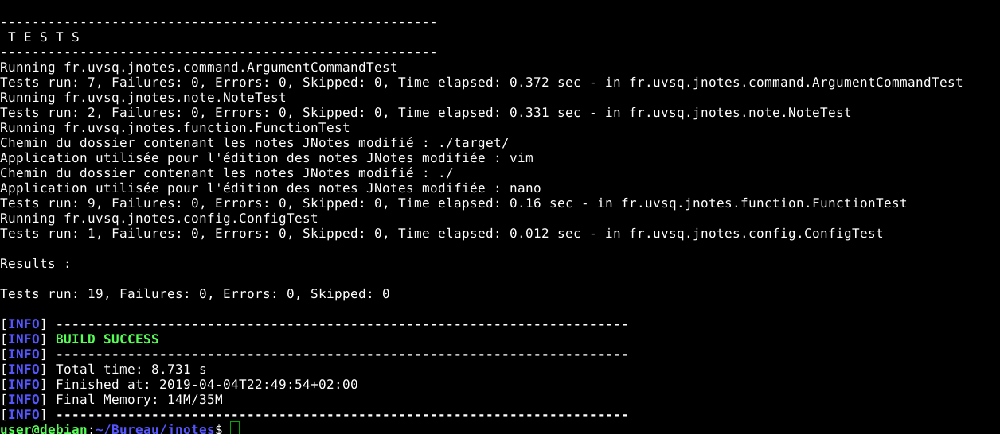
			
mvn package compile le projet et lance les tests.
	  
	    			
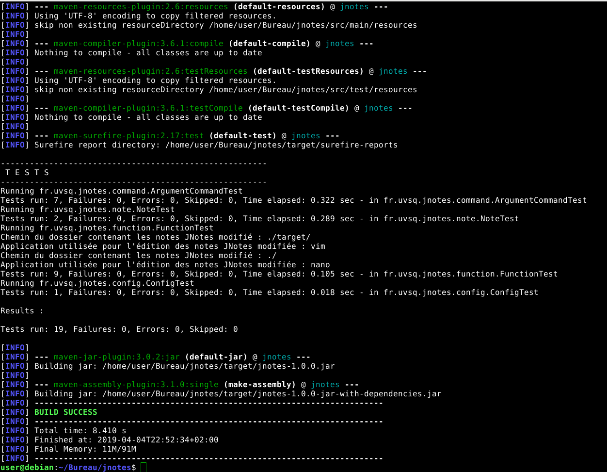
				
java -jar target/jnotes-1.0.0-jar-with-dependencies.jar execute le programme.
	  
	    			
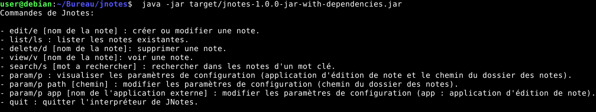
			
Une fois l'application lancé l'utilisateurs a acces à différentes fonctionnalitées décrite si dessous.

Help
--
En tapant help ou h le terminal affiche la liste des commandes supportées par l'application jnotes.
    
  

Edit
--
En tapant edit [nom de la note] ou e [nom de la note] un écran apparait affichant la note.  
Si la note n'existait pas elle est créer et pré remplis.  
  
    
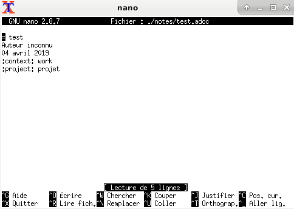  

Liste
--
En tapant list ou ls le terminal affiche la liste des notes contenues dans le dossier de note configuré dans lapplication.
    
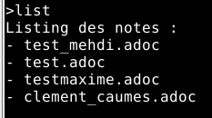  

Delete
--
En tapant delete [nom de la note] ou d [nom de la note] le programme supprime la note et affiche un message.

    
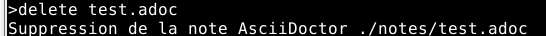

View
--
En tapant view [nom de la note] ou v [nom de la note] la note est ouverte dans firefox.
  
    

L'index est également consultable. Il est possible de le trier, par contexte par exemple.

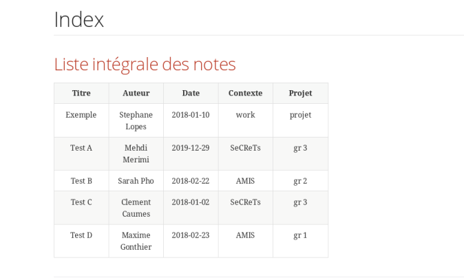

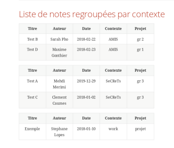

Search
--
En tapant search [condition1] [condition2] .. ou s [condition1] [condition2] .. , l'application recherche les notes qui respectent toutes les conditions.

Les conditions doivent être protégées par des guillemets ".

Selon leur forme elles permettent d'effectuer 3 types de recherches :

-Recherche par tag :
    La condition devient : 
           --     ":tag:valeur"
    [tag] prend les valeurs "author", "title", "context" ou "project"
    
Si [valeur] au moins un caractere special alors le programme recherchera les notes dont le champ [tag] est complètement égal à [valeur].
Dans l'autre cas, on peut effectuer une recherche par mot qui interpretera les expressions régulières.
    
-Recherche par date
    Il est possible de rechercher les notes selon leur date.
    Pour trouver une note ayant été rédigée entre [date1] et [date2], la requête est :
           --    ":date:[date1 TO date2]"
    Pour trouver toutes les notes ayant été écrites à partir de date1 :
           --    ":date:[date1 TO *]"
    Et inversement pour les notes ayant été écrites avant date2 :
           --    ":date:[* TO date2]"
    On peut aussi rechercher les notes écrites à toute date, même si ls est plus efficace pour cela :
           --    ":date:[* TO *]"
 
Une condition qui contient au moins un ':' sera interprétée comme une recherche par tag ou par date.
                
-Recherche dans le corps
    La condition requise pour cette recherche peut s'écrire ainsi :
           --   "regex1 regex2 ..."
    Les espaces prennent ici le rôle de séparateur entre chaque expression régulière. 
    La portée de la recherche dans le corps est le mot: Il n'est pas possible de rechercher des ensembles de mots séparés par des caractères spéciaux ( ex: espace, virgule, etc )
    L'ordre dans l'argument ne donne pas d'indication sur l'ordre dans le document.
    
    
Les recherches ne sont pas case sensitives à l'exception des requêtes par date.
Il est possible de combiner les conditions, le programme cherchera alors les fichiers qui respectent chacunes des conditions en entrée. 
    
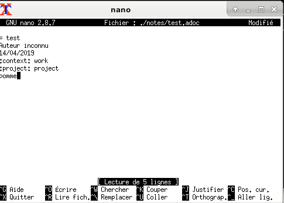
  
    
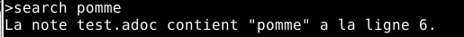
		

Param
--
En tapant param ou p, le terminal affiche les paramètres, c'ets à dire l'application d'édition des notes et le chemin du dossier contenant les notes.
  
    
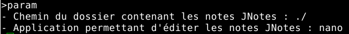

Param path
--
En tapant param path [nouveau chemin] ou p path [nouveau chemin], le chemin du dossier contenant les notes est modifié.
  
    
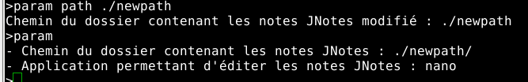

Param app
--
En tapant param app [nom de l'application] ou p app [nom de l'application], l'application de modification des notes est modifié.
  
    
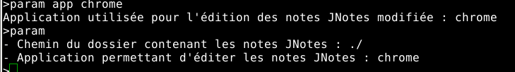

Quit
--
Taper quit permet de quitter l'application.
		

Manuel technique JNotes
==

Introduction
--

Ce manuel a pour objectif de décrire les pattern utilisés lors de l'implémentation de ce projet.
Plus précisement nous allons expliciter les raisons de leurs utilisation.

Singleton
--

Le singleton est utilisé dans App.java.
Le main est unique, ainsi l'utilisation du pattern singleton permet de facilement créer cette unicité.

Observer
--

Function.java utilise le pattern observer.
L'objectif est de modifier l'index directement lors de la création ou la suppresion d'une note.
Ainsi lorsqu'une note change d'état, l'index en est averti et il se met automatiquement a jour.

Command
--

Le pattern command est utilisé dans ICommand.java, Interpretor.java et ScannerCommand.java

Builder
--

Note.java utilise le pattern builder.  
Une note est déterminé par son titre mais sa date, l'auteur, le projet et le contexte sont optionels.
Ainsi le pattern builder permet d'implémenter ces attributs sous la forme d'options facilement.
De plus il y a de nombreux paramètres, ainsi le pattern builder permet d'éviter une multiplication du nombre de 
paramètres utilisés.
