Manuel utilisateur JNotes
==
Auteurs : Clément Caumes - Mehdi Merimi - Sarah Ngoc-Mai Pho - Maxime Gonthier  
--

Introduction
--

L'application "JNotes" est un outil permettant la gestion de notes utilisant asciidoctor.
Elle permet à l'utilisateur de modifier, supprimer, lister ou voir des notes. Elle contient également une fonction de recherche et un index triant les notes par ordre alphabétique.
Ce guide a été conçu pour faciliter l'utilisation de l'application.

  
Lancement de l'application
--

mvn test lance l'ensemble des tests junit.
	  
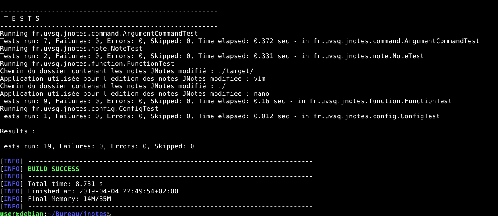
			
mvn package compile le projet et lance les tests.
	  
	    			
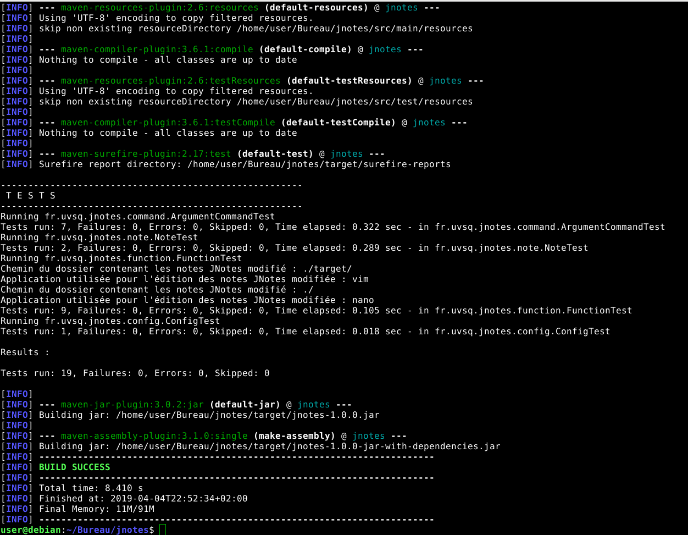
				
java -jar target/jnotes-1.0.0-jar-with-dependencies.jar exécute le programme.
	  
	    			
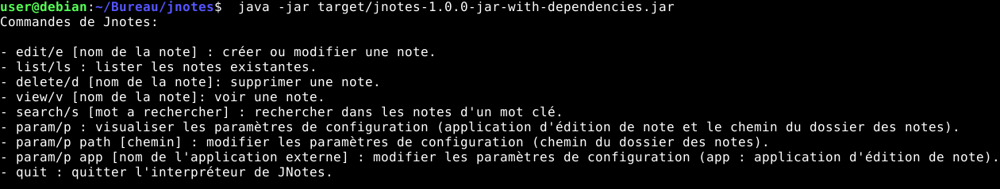
			
Une fois l'application lancée, l'utilisateur a accès à différentes fonctionnalités décrites ci-dessous.

Help
--
En tapant help ou h, le terminal affiche la liste des commandes supportées par l'application jnotes.
    
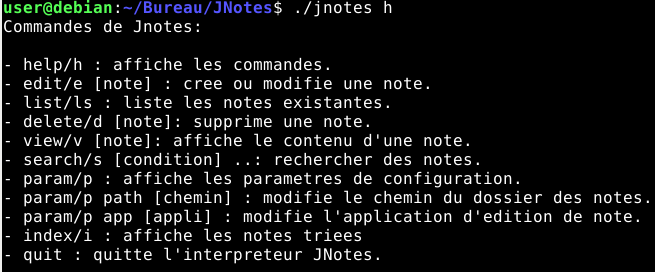  

Edit
--
En tapant edit [nom de la note] ou e [nom de la note], un écran apparait affichant la note.  
Si la note n'existait pas, elle est créée et pré-remplie.  
  
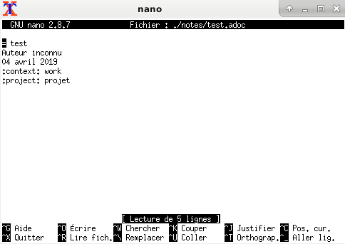  

List
--
En tapant list ou ls, le terminal affiche la liste des notes contenues dans le dossier de notes configuré dans l'application.
    
  

Delete
--
En tapant delete [nom de la note] ou d [nom de la note], le programme supprime la note et affiche un message.

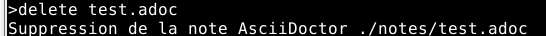

View
--
En tapant view [nom de la note] ou v [nom de la note], la note est ouverte dans firefox.
   
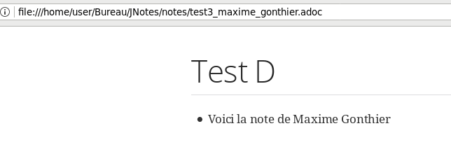

Index
--
L'index est également consultable. Cet index a plusieurs tris : par ordre alphabétique de titre, selon l'attribut contexte, selon l'attribut projet et enfin par mois.

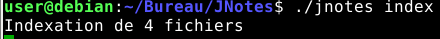

On obtiendra donc :

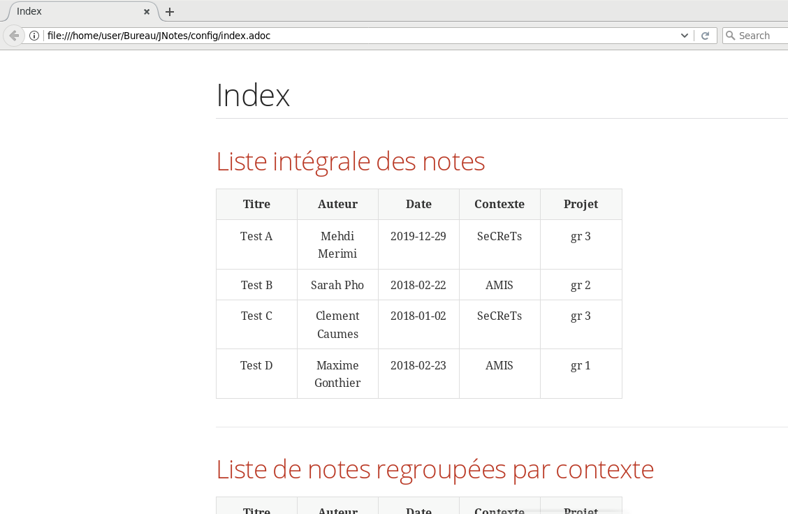

Search
--
En tapant search [condition1] [condition2] .. ou s [condition1] [condition2] .. , l'application recherche les notes qui respectent toutes les conditions.

Les conditions doivent être protégées par des guillemets ".

Selon leur forme, elles permettent d'effectuer 3 types de recherches :

-Recherche par tag :
    La condition devient : 
           --     ":tag:valeur"
    [tag] prend les valeurs "author", "title", "context" ou "project"
    
Si [valeur] au moins un caractere special alors le programme recherchera les notes dont le champ [tag] est complètement égal à [valeur].
Dans l'autre cas, on peut effectuer une recherche par mot qui interpretera les expressions régulières.
    
-Recherche par date
    Il est possible de rechercher les notes selon leur date.
    Pour trouver une note ayant été rédigée entre [date1] - 1 jour et [date2] inclus, la requête est :
           --    ":date:[date1 TO date2]"
    Pour trouver une note a une date [date1] a un jour près ([date1] et [date1] - 1jour):
           --    ":date:[date1 TO date1]"
    Pour trouver toutes les notes ayant été écrites à partir de [date1] - 1 incluse :
           --    ":date:[date1 TO *]"
    Et inversement pour les notes ayant été écrites jusqu'à [date2] incluse :
           --    ":date:[* TO date2]"
    On peut aussi rechercher les notes écrites à toute date, même si ls est plus efficace pour cela :
           --    ":date:[* to *]"

Une condition qui contient au moins un ':' sera interprétée comme une recherche par tag ou par date.
                
-Recherche dans le corps
    La condition requise pour cette recherche peut s'écrire ainsi :
           --   "regex1 regex2 ..."
    Les espaces prennent ici le rôle de séparateur entre chaque expression régulière. 
    La portée de la recherche dans le corps est le mot: Il n'est pas possible de rechercher des ensembles de mots séparés par des caractères spéciaux ( ex: espace, virgule, etc )
    L'ordre dans l'argument ne donne pas d'indication sur l'ordre dans le document.
    
    
Les recherches ne sont pas cases sensitives.
Il est possible de combiner les conditions, le programme cherchera alors les fichiers qui respectent chacunes des conditions en entrée. 

Voici un exemple simple de recherche. Pour cela, on crée préalablement une note par exemple :
    
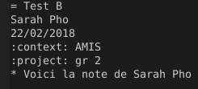
  
On fait ensuite la recherche et on remarque que 2 notes contiennent l'élément recherché (dont la note qui vient d'être créée).

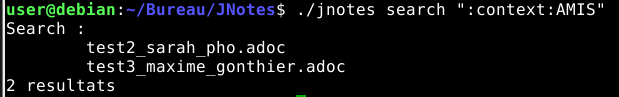
		
Param
--
En tapant param ou p, le terminal affiche les paramètres, c'ets à dire l'application d'édition des notes et le chemin du dossier contenant les notes.
     
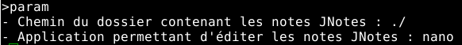

Param path
--
En tapant param path [nouveau chemin] ou p path [nouveau chemin], le chemin du dossier contenant les notes est modifié.
     
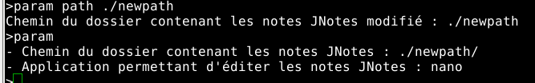

Param app
--
En tapant param app [nom de l'application] ou p app [nom de l'application], l'application de modification des notes est modifié.
      
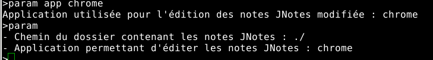

Quit
--
Taper quit permet de quitter l'application.
		

Manuel technique JNotes
==

Introduction
--

Ce manuel a pour objectif de décrire les patterns utilisés lors de l'implémentation de ce projet.
Plus précisement, nous allons expliciter les raisons de leurs utilisations.

Packages 
--
Nous avons une série de packages dans JNotes : 

- le package "note" contient limplémentation de la note ainsi que toutes les classes nécessaires au pattern iterator. Ce patern permettra par la suite de trier ces notes selon un critère particulier.
- le package "utils" contient les classes qui seront manipulés dans toutes les autres classes. Il contient des classes "bas niveau" permettant de manipuler plus facilement les fichiers par exemple. 
- le package "index" contient toutes les classes relatives à la manipulation de listes à l'aide de la bibliothèque de recherche par mots-clés Lucene.
- le package "config" contient toutes les classes relatives à la configuration de l'application (notamment le logiciel d'édition de notes ou la localisation du dossier contenant les notes de JJNotes).
- le package "command" contient toutes les classes relatives aux classes maîtresses de la gestion des commandes.
- le package "function" contient toutes les classes relatives aux fonctionnalités proposés par l'application. Le coeur de JNotes est la classe Function va regrouper par le biais du pattern command toutes les déclarations de méthodes pour chaque commande. 
- le package "exception" contient toutes les exceptions lancées par l'application.

Patterns
--

Singleton
-

Le singleton est utilisé pour la classe App.
Le main est unique, ainsi l'utilisation du pattern singleton permet de facilement créer cette unicité. 

Observer
-

Nous avons utilisé le pattern observer lors de l'édition, la suppression d'une note ou bien lors de la modification de paramètres puisque le fichier index.adoc doi être mis à jour. Cette fonctionnalité montre que le pattern observer est le plus approprié car on reformera index.adoc à chaque mise à jour des notes. 

Command
-

Le pattern command est le coeur de l'application. Il permet de maintenir facilement les différentes commandes proposés par JNotes. En effet, chaque fonctionnalité (Delete, Edit, Index, Listing, Param, Search, Update, View) est déclaré dans une classe mais c'est la classe principale du pattern command (Function) qui les gère toutes. Ainsi, 

Iterator
-

Afin de pouvoir trier correctement les notes selon les contextes, les projets ou même selon la date, il a été utile d'utiliser le pattern iterator. Cela a permis de trier 
facilement les notes selon un critère. 

Builder
-

Note.java utilise le pattern builder.  
Une note est déterminé par son titre mais sa date, l'auteur, le projet et le contexte sont optionels.
Ainsi le pattern builder permet d'implémenter ces attributs sous la forme d'options facilement.
De plus il y a de nombreux paramètres, ainsi le pattern builder permet d'éviter une multiplication du nombre de 
paramètres utilisés.

