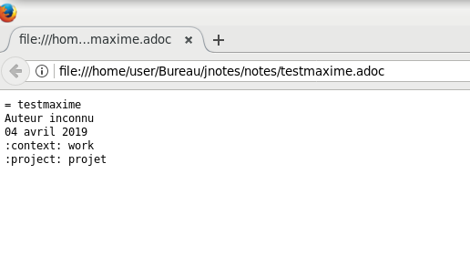

Manuel utilisateur  
==
Auteurs : Clément Caumes - Mehdi Merimi - Sarah Ngoc-Mai Pho - Maxime Gonthier  
--

JNotes  
	
Introduction
--

L'application "JNotes" est un outil permettant la gestion de notes utilisant asciidoctor.
Elle permet à l'utilisateur de modifier, supprimer, lister ou voir des notes. Elle contient également une fonction de recherche et un index triant les notes par ordre alphabétique.
Ce guide a été conçu pour faciliter l'utilisation de l'application.

			
Fonctionnalitées
--

Lancement de l'application

*$mvn$ $test$ lance l'ensemble des tests junit.
			

			
*$mvn$ $package$ compile le projet et lance les tests.
				

				
*$java$ $-jar$ $target/jnotes-1.0.0-jar-with-dependencies.jar$ execute le programme.\\
				

			
Une fois l'application lancé l'utilisateurs a acces à différentes fonctionnalitées décrite si dessous.

Edit
--
En tapant edit [nom de la note] ou e [nom de la note] un écran apparait affichant la note.  
Si la note n'existait pas elle est créer et pré remplis.  
  

Liste
--
  

Delete
--
En tapant delete [nom de la note] ou d [nom de la note] le programme supprime la note et affiche un message.

View
--
En tapant view [nom de la note] ou v [nom de la note] la note est ouverte dans firefox.

Search
--
A ecrire
		

Param
--
En tapant param ou p, le terminal affiche les paramètres, c'ets à dire l'application d'édition des notes et le chemin du dossier contenant les notes.

Param path
--
En tapant param path [nouveau chemin] ou p path [nouveau chemin], le chemin du dossier contenant les notes est modifié.

Param app
--
En tapant param app [nom de l'application] ou p app [nom de l'application], l'application de modification des notes est modifié.

Quit
--
Taper quit permet de quitter l'application.
		

